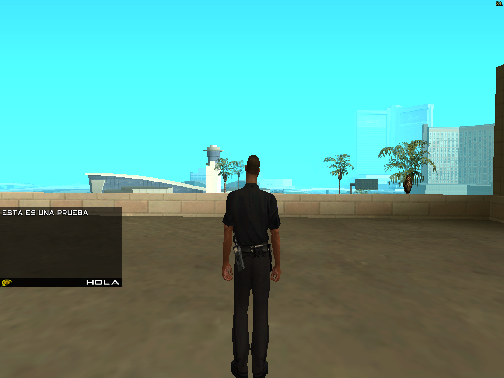
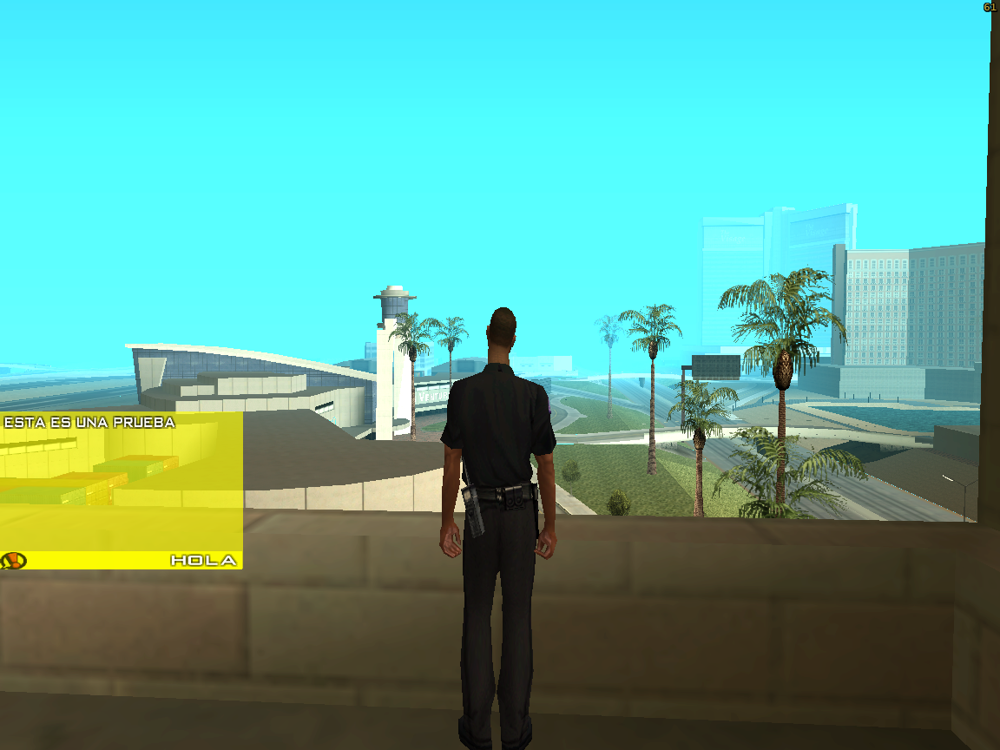
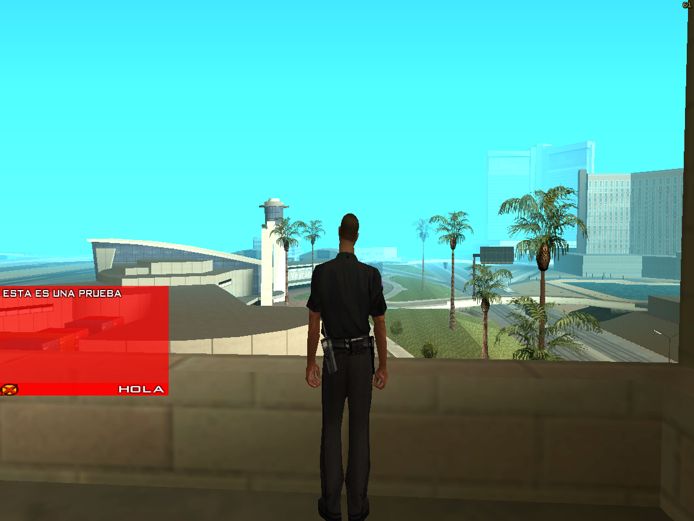
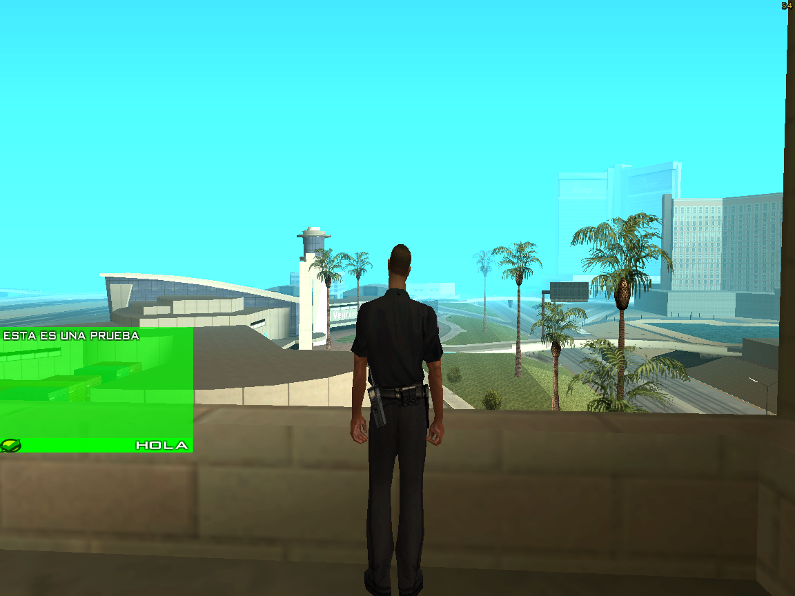

# yet another notification system
 sistema básico de notificación

### Introducción
 Otro sistema de notificacion, ideal para no sobrecargar el chat del juego

### Funciones
 Por ahora sólo cuenta con una sola, en un futuro se planea agregar más
 ```
 ShowPlayerNotification(playerid, textfotter[], text[], time = 3, style = NOTIFICATION_BLACK)
 ```
 Notas: En el párametro `time` el tiempo es en segundos, default 3 segundos.
 En el párametro `style` por a hora sólo poseé 3 estilos que son:
 ```NOTIFICATION_BLACK, NOTIFICATION_YELLOW, NOTIFICACION_RED, NOTIFICATION_GREEN```
### Imágenes
>NOTIFICATION_BLACK


>NOTIFICATION_YELLOW


>NOTIFICATION_RED


>NOTIFICATION_GREEN

